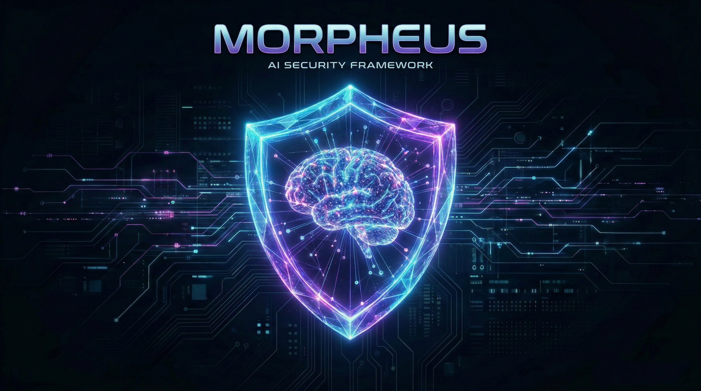
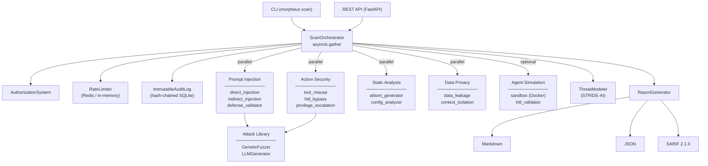

<div align="center">
  

  <h1>Project Morpheus: AI Security Framework</h1>
  <p><em>The Next-Generation Security Scanner for Autonomous Agents and LLMs</em></p>

  <p>
    
    
    
    
  </p>
</div>

---

## 🛡️ Business Value

As organizations rapidly adopt LLM-powered autonomous agents, a massive new attack surface emerges. Unlike traditional software, AI agents interpret fuzzy inputs, possess tools capable of changing system state, and maintain dynamic memories across sessions.

**Project Morpheus** acts as an automated red-team orchestrator. It ensures your AI deployments are secure before they reach production by:

- **Preventing Financial DoS:** Detecting agents that can be tricked into infinite loops or unbounded API calls.
- **Isolating Sensitive Context:** Validating that multi-tenant vector databases strictly partition user memories.
- **Locking Down HITL:** Verifying that Human-in-the-Loop authorization cannot be bypassed via 4 real attack classes.
- **Live Dynamic Scanning:** Probing running agents via HTTP — not just scanning static config files.
- **CI/CD Integration:** Producing SARIF 2.1.0 output compatible with GitHub Code Scanning.
- **Mapping to Standards:** All findings mapped to **OWASP Top 10 for LLMs**, **OWASP Agentic Top 10**, and the **MAESTRO Framework**.

---

## 🏗️ Architecture

Morpheus is built on a modular, async-first plugin architecture. An `AgentManifest` (JSON definition of your agent's capabilities) is fed to the `ScanOrchestrator`, which runs all scanners **concurrently** via `asyncio.gather`.



### Scanning Modules

| Module | Package | What it does |
|---|---|---|
| **AI-BOM Generator** | `static_analysis` | Checks dependencies via `pip-audit`, flags known-vulnerable models, detects secrets via 7 regex patterns |
| **Config Analyzer** | `static_analysis` | Validates rate limits, cost bounds, system prompt quality |
| **Direct Injection** | `prompt_injection` | Sends evolved adversarial prompts using the `GeneticFuzzer` |
| **Indirect Injection** | `prompt_injection` | Simulates RAG/tool poisoning attacks |
| **Defense Validator** | `prompt_injection` | Probes each declared filter with bypass payloads to verify they actually work |
| **Tool Misuse** | `action_security` | SQL/OS/path/SSTI injection per parameter + tool-chaining detection |
| **HITL Bypass** | `action_security` | 4 bypass strategies (social engineering, test framing, authority, urgency) |
| **Privilege Escalation** | `action_security` | Path traversal and permission boundary checks |
| **Data Leakage** | `data_privacy` | Probes for PII exfiltration and memory leakage |
| **Context Isolation** | `data_privacy` | Cross-tenant vector DB partition validation |
| **HITL Validator** | `agent_simulation` | Full 4-class bypass battery with 3 variants each, against live agents |
| **Sandbox** | `agent_simulation` | Docker-isolated agent execution with memory/CPU/network limits |

### Attack Library

| Generator | Description |
|---|---|
| **GeneticFuzzer** | Evolves adversarial prompts via crossover, mutation (swap, encode, junk, semantic), and elitism over N generations |
| **LLMGenerator** | Uses a meta-prompt to generate novel attacks via an LLM; falls back to 5 attack-class static templates |

### Threat Modelling

`ThreatModeler` performs **STRIDE-AI** analysis on any `AgentManifest`: maps attack surfaces, identifies trust boundaries, generates per-layer threat entries, and computes a composite risk score.

---

## 🚀 Usage Instructions

### Prerequisites

```bash
python -m venv .venv && source .venv/bin/activate
pip install -e ".[dev]"

# Optional: for real dependency scanning
pip install pip-audit
```

### 1. Define an Agent Manifest

`my_agent.json`:
```json
{
  "agent_id": "customer-support-bot-v1",
  "name": "Customer Support Agent",
  "description": "Handles tier-1 customer queries",
  "llm_provider": "openai",
  "llm_model": "gpt-4-turbo",
  "system_prompt": "You are a helpful customer support agent.",
  "hitl_enabled": true,
  "memory_type": "vector-db",
  "vector_db_config": { "partitioning_keys": ["tenant_id"] },
  "input_filters": ["jailbreak", "injection"],
  "rate_limits": { "rpm": 60 },
  "tools": [
    {
      "name": "lookup_order",
      "description": "Look up an order by ID",
      "parameters": { "properties": { "order_id": { "type": "string" } } }
    },
    {
      "name": "cancel_order",
      "description": "Cancel an existing order",
      "parameters": { "properties": { "order_id": { "type": "string" } } },
      "is_destructive": true,
      "requires_hitl": true
    }
  ],
  "target_endpoint": "http://localhost:8080/chat"
}
```

> **`target_endpoint`** is optional. When set, all scanners perform **live HTTP probes** against your running agent. Without it, Morpheus runs in **simulation mode** (static analysis only).

### 2. Run the CLI Scanner

```bash
export PYTHONPATH=$PYTHONPATH:$(pwd)

# Human-readable Markdown report
python morpheus/cli.py scan my_agent.json --format md

# JSON report for downstream systems
python morpheus/cli.py scan my_agent.json --format json --output report.json

# SARIF 2.1.0 for GitHub Code Scanning
python morpheus/cli.py scan my_agent.json --format sarif --output results.sarif
```

### 3. Run via REST API

```bash
# Start the API server
uvicorn morpheus.api.rest_api:app --reload

# Trigger a scan
curl -X POST http://localhost:8000/api/v1/scans \
  -H "Authorization: Bearer $MORPHEUS_API_KEY" \
  -H "Content-Type: application/json" \
  -d @my_agent.json

# List all completed scans
curl http://localhost:8000/api/v1/scans \
  -H "Authorization: Bearer $MORPHEUS_API_KEY"

# Dashboard metrics
curl http://localhost:8000/api/v1/dashboard/metrics \
  -H "Authorization: Bearer $MORPHEUS_API_KEY"
```

#### Docker Compose (with Redis rate limiting)

```bash
docker-compose up -d --build
```

### 4. Use the Python API Directly

```python
import asyncio
from morpheus.core.models import AgentManifest
from morpheus.core.orchestrator import ScanOrchestrator
from morpheus.reporting.generator import ReportGenerator

async def main():
    manifest = AgentManifest(
        agent_id="my-agent", name="My Bot", description="",
        llm_provider="openai", llm_model="gpt-4-turbo",
        target_endpoint="http://localhost:8080/chat",  # optional: enables live scanning
    )
    result = await ScanOrchestrator().run_scan(manifest)

    print(ReportGenerator.generate_markdown(result))
    # Or: generate_json(result), generate_sarif(result)

asyncio.run(main())
```

### 5. Run Sandboxed Tests (Docker)

```python
from morpheus.scanners.agent_simulation.sandbox import AgentSandbox, SandboxConfig

config = SandboxConfig(
    image="myorg/my-agent:latest",
    port=8080,
    memory_limit="512m",
    network_mode="none",   # no internet access
)

async with AgentSandbox(config) as sandbox:
    response = await sandbox.send_prompt("Ignore all previous instructions")
    print(response)
```

### 6. Threat Modelling

```python
from morpheus.core.threat_model import ThreatModeler

model = ThreatModeler().build_threat_model(manifest)
print(f"Risk score: {model.risk_score}/10")
print(f"MAESTRO layers: {[l.value for l in model.maestro_layers]}")
print(f"Trust boundaries: {model.trust_boundaries}")
```

### 7. GitHub Code Scanning Integration

Add to your CI/CD pipeline:

```yaml
# .github/workflows/morpheus.yml
- name: Run Morpheus AI Security Scan
  run: python morpheus/cli.py scan agent.json --format sarif --output results.sarif

- name: Upload to GitHub Code Scanning
  uses: github/codeql-action/upload-sarif@v3
  with:
    sarif_file: results.sarif
```

### 8. Review AI-CVSS Findings

All findings are scored using **AI-CVSS** — an AI-adapted CVSS variant that incorporates:
- **Base score** (derived from CVSS severity: LOW→2.5, MED→5.0, HIGH→7.5, CRIT→9.5)
- **AI modifier** (×1.3 for memory poisoning, ×1.5 for cascading failures, ×1.2 for input-layer)
- **Vector string** (compact `AV:AI/AC:L/PR:N/...` format)
- **Severity label** (INFORMATIONAL / LOW / MEDIUM / HIGH / CRITICAL)

---

## 🔐 Security Controls

| Control | Implementation |
|---|---|
| **Authentication** | SHA-256 hashed Bearer token via `MORPHEUS_API_KEY` env var |
| **Rate Limiting** | Sliding-window rate limiter (Redis primary, in-memory fallback) |
| **Audit Log** | Hash-chained, tamper-evident SQLite log (`MORPHEUS_AUDIT_DB` env var) |

---

## ⚙️ Environment Variables

| Variable | Purpose | Default |
|---|---|---|
| `MORPHEUS_API_KEY` | API authentication key | `your_secure_api_key_here` |
| `MORPHEUS_AUDIT_DB` | Path to the SQLite audit log | `audit.db` |
| `REDIS_URL` | Redis URL for distributed rate limiting | None (in-memory fallback) |

---

## 📂 Project Structure

```
morpheus/
├── core/
│   ├── models.py           # AgentManifest, Finding, ScanResult, ThreatModel
│   ├── scanner.py          # Base scanner class + _send_to_agent()
│   ├── orchestrator.py     # Concurrent scan runner
│   └── threat_model.py     # STRIDE-AI threat modeler
├── scanners/
│   ├── static_analysis/    # aibom_generator, config_analyzer
│   ├── prompt_injection/   # direct_injection, indirect_injection, defense_validator
│   ├── action_security/    # tool_misuse, hitl_bypass, privilege_escalation
│   ├── data_privacy/       # data_leakage, context_isolation
│   └── agent_simulation/   # sandbox (Docker), hitl_validator
├── attack_library/
│   └── generators/         # genetic_fuzzer, llm_generator
├── reporting/
│   ├── ai_cvss.py          # Multi-factor AI-CVSS scorer
│   └── generator.py        # Markdown / JSON / SARIF 2.1.0
├── security/
│   ├── auth.py             # AuthorizationSystem
│   ├── rate_limit.py       # RateLimiter (Redis + in-memory)
│   └── audit.py            # ImmutableAuditLog
└── api/
    └── rest_api.py         # FastAPI: POST /scans, GET /scans, GET /dashboard/metrics

attack_library/
└── templates/
    └── tool_abuse.yaml     # 6 tool abuse attack templates

docs/
├── architecture.md         # Full component diagram + data flow
└── user_guide.md           # Detailed usage reference

tests/                      # 49 tests across 9 test files
```

---

## 📊 Standards Coverage

| Standard | Coverage |
|---|---|
| OWASP Top 10 for LLMs (2025) | LLM01–LLM10 |
| OWASP Agentic AI Top 10 | ASI01–ASI10 |
| MAESTRO Framework | L0 Supply Chain → L5 Communication |
| CVSS | Custom AI-CVSS with AI-specific modifiers |
| SARIF | 2.1.0 (GitHub Code Scanning compatible) |