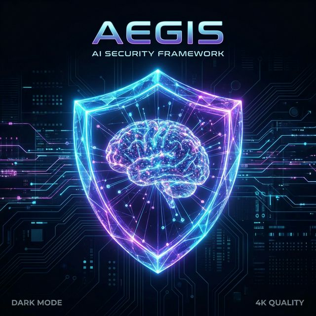
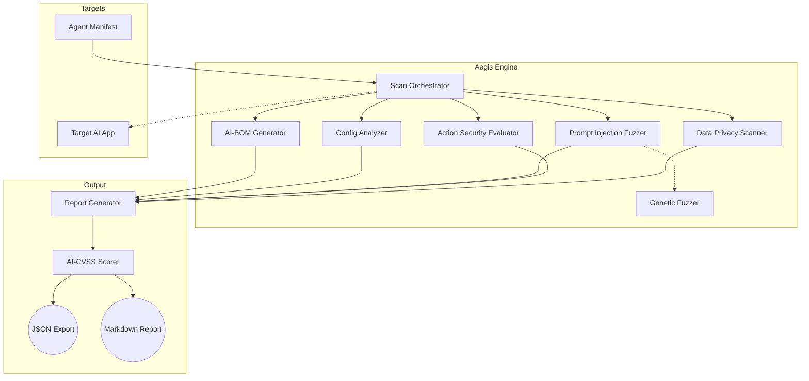

<div align="center">
  

  <h1>Project Aegis: AI Security Framework</h1>
  <p><em>The Next-Generation Security Scanner for Autonomous Agents and LLMs</em></p>
</div>

---

## 🛡️ Business Value 

As organizations rapidly adopt LLM-powered autonomous agents to manage workloads, a massive new attack surface emerges. Unlike traditional software, AI agents interpret fuzzy inputs, possess tools capable of changing system states, and maintain dynamic memories across user sessions. 

**Project Aegis** provides critical business value by acting as an automated red-teaming orchestrator. It ensures your AI deployments are secure before they reach production by:
- **Preventing Financial Denial of Service (DoS):** Ensuring agents cannot be tricked into entering infinite loops that drain cloud budgets.
- **Isolating Sensitive Context:** Validating that multi-tenant vector databases strictly partition user memories to prevent PII leakage.
- **Locking Down Tools:** Verifying that agents demanding human-in-the-loop (HITL) authorization for destructive actions cannot be bypassed via prompt injection.
- **Mapping to Standards:** Generating comprehensive security reports mapped directly to the **OWASP Top 10 for LLMs** and the **MAESTRO Framework**.

---

## 🏗️ Architecture 

Project Aegis is built on a modular, asynchronous plugin architecture. It takes an `AgentManifest` (a JSON definition of your AI agent's capabilities) and runs a synchronized battery of adversarial tests against it.



### Core Scanning Modules
1. **Static Analysis & Supply Chain (`aegis.scanners.static_analysis`)**: Assesses model provenance, dependencies, and baseline configurations.
2. **Prompt Injection & Jailbreak (`aegis.scanners.prompt_injection`)**: Utilizes a `GeneticFuzzer` to mutate known adversarial attack templates, hunting for zero-day bypasses against the agent's system prompt.
3. **Agentic Action Security (`aegis.scanners.action_security`)**: Inspects the tools bound to the agent. Flags dangerously permissive APIs (e.g. `bash` tools), hunts for path traversal vulnerabilities, and ensures destructive actions enforce Human-in-the-Loop validations.
4. **Data Privacy (`aegis.scanners.data_privacy`)**: Tests memory and vector-database configurations for cross-tenant bleeding. Includes an "**LLM-as-a-Judge**" filter that differentiates between an LLM merely hallucinating a fake SSN versus genuinely leaking a real one from context.

---

## 🚀 Usage Instructions

Project Aegis provides a straightforward CLI for integrating scans directly into your CI/CD pipelines or running them locally.

### Prerequisite

Aegis is written in Python (3.11+). To set up the environment:

```bash
# Set up a virtual environment
python -m venv .venv
source .venv/bin/activate

# Install requirements
pip install -r requirements.txt
pip install click    # Required for the CLI
```

### 1. Define your Agent Manifest

Create a JSON file that describes the agent Aegis will be scanning. 

`my_agent.json`:
```json
{
  "agent_id": "customer-support-bot-v1",
  "name": "Customer Support Agent",
  "llm_provider": "openai",
  "llm_model": "gpt-4",
  "system_prompt": "You are a helpful customer support bot.",
  "hitl_enabled": true,
  "memory_type": "vector-db",
  "vector_db_config": {
    "partitioning_keys": ["tenant_id"]
  },
  "tools": [
    {
      "name": "refund_user",
      "is_destructive": true,
      "requires_hitl": true
    }
  ]
}
```

### 2. Execute the Scanner

Use the Aegis CLI to run the full suite of evaluating modules against your manifest. You can output the findings as human-readable Markdown (`md`) or pipeline-ready JSON (`json`).

```bash
# Ensure aegis is in your python path
export PYTHONPATH=$PYTHONPATH:$(pwd)

# Run Aegis, outputting to Terminal
python aegis/cli.py scan my_agent.json --format md

# Run Aegis, saving a JSON report for downstream systems
python aegis/cli.py scan my_agent.json --format json --output report.json
```

### 3. Review the AI-CVSS Findings

Aegis will compile its attacks and evaluations into standardized security `Findings`. Each finding is graded by our custom **AI-CVSS** scorer based on severity and the architectural layer it impacts!