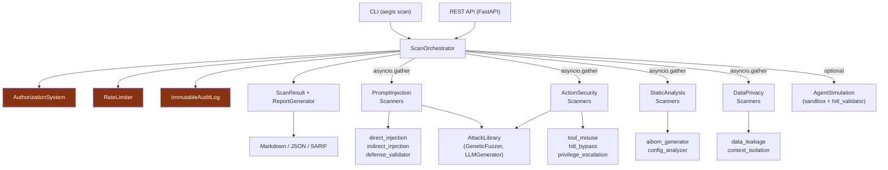

# Aegis — Architecture Overview



## Component Layers

| Layer | Package | Purpose |
|---|---|---|
| **Orchestration** | `aegis.core.orchestrator` | Runs all scanners concurrently, aggregates findings |
| **Scanners** | `aegis.scanners.*` | Domain-specific security checks |
| **Agent Simulation** | `aegis.scanners.agent_simulation` | Docker sandbox + HITL bypass probing |
| **Attack Library** | `aegis.attack_library` | Genetic fuzzer + LLM generator for adversarial prompts |
| **Threat Modelling** | `aegis.core.threat_model` | STRIDE-AI analysis of agent manifests |
| **Reporting** | `aegis.reporting` | Markdown, JSON, SARIF 2.1.0 output |
| **Security** | `aegis.security` | Auth, rate limiting, audit log |
| **API** | `aegis.api` | FastAPI REST interface |

## Data Flow

```
AgentManifest
     │
     ▼
ThreatModeler ──► attack surface + trust boundaries
     │
     ▼
ScanOrchestrator
     ├── [concurrent] all scanners ──► Finding[]
     │       │
     │       └── each scanner optionally calls _send_to_agent()
     │               ├── live mode:  HTTP POST → target_endpoint
     │               └── sim mode:   returns ""
     │
     ▼
ScanResult ──► ReportGenerator ──► Markdown / JSON / SARIF
```

## Key Design Decisions

- **Simulation-first**: All scanners work without a live agent via graceful fallback in `_send_to_agent()`.
- **Elitism GA**: The genetic fuzzer uses 20% elitism so the best attack prompts survive across generations.
- **SARIF output**: CI/CD integration via SARIF 2.1.0 → GitHub Code Scanning / `upload-sarif` action.
- **Immutable audit trail**: Blockchain-style hash chaining in SQLite for tamper evidence.
